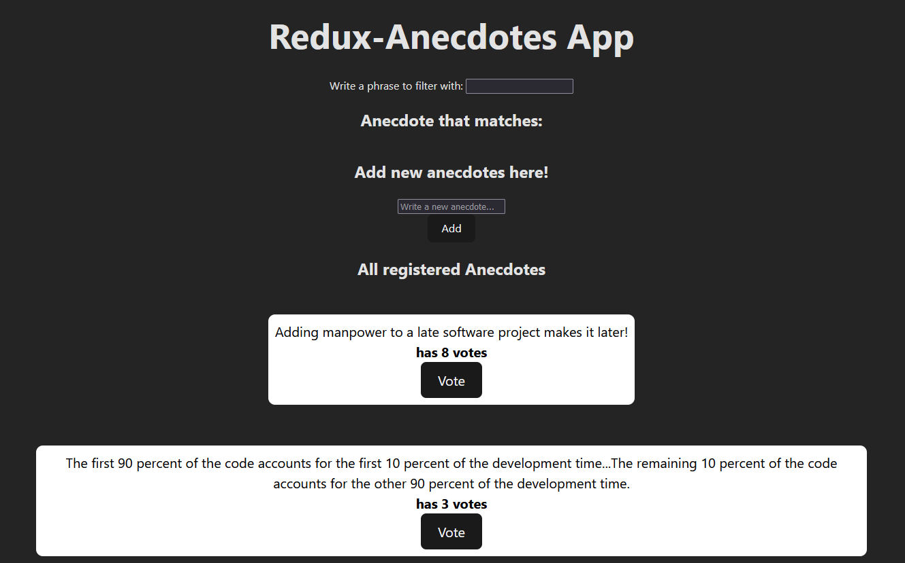

# About Part 6

In this part of the Full Stack Open course I learned about different state management solutions and the flux architecture. I developed small projects using Redux Toolkit, useReducer and useContext, and React Query.

## unicode-redux App

The [unicode-redux](./unicode-redux/) app is the final version of the application developed between exercises 6.1 and 6.2. It uses the Redux library as state management. The app shows statistics about total feedback, it has three options for feedback: Good, Ok, Bad, and a restart option. The app shows the counter for all three options, average between all feedback and the positive as a percentage.

## redux-anecdotes App

The [redux-anecdotes](./redux-anecdotes/) app is the final version of the application developed between exercises 6.3 and 6.19. The app uses Redux Toolkit as state management and json-server to simulate a small database. The app shows a list of anecdotes alongside the total of votes a anecdote has and a button to vote for that specific anecdote. You can add new anecdotes using the small form and the app also has a "filter with" section to show a anecdote that includes the phrase you are using as a filter.

## anecdotes-react-query App

The [anecdotes-react-query](./anecdotes-react-query/) app is the final version of the application developed between exercises 6.20 and 6.24. The app uses React Query for data fetching and communication with the backend, it also uses the React redux solution with the useReducer and useContext hooks for state management and the json-server library to simulate a small database. The app shows a list of anecdotes alongside the total of votes a anecdote has and a button to vote for that specific anecdote. You can add new anecdotes using the small form and it shows different type of notifications when adding a new anecdote, voting and when trying to add a anecdote that is smaller than 5 characters.

