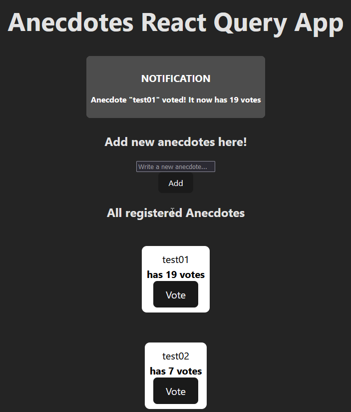

# anecdotes-react-query App

The anecdotes-react-query app is the final version of the application developed between exercises 6.20 and 6.24. The app uses React Query for data fetching and communication with the backend, it also uses the React redux solution with the useReducer and useContext hooks for state management and the json-server library to simulate a small database. The app shows a list of anecdotes alongside the total of votes a anecdote has and a button to vote for that specific anecdote. You can add new anecdotes using the small form and it shows different type of notifications when adding a new anecdote, voting and when trying to add a anecdote that is smaller than 5 characters. Run `npm install`, `npm run server`, and `npm run dev` to run the app.

