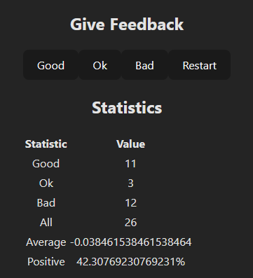

# unicode-redux App

The unicode-redux app is the final version of the application developed between exercises 6.1 and 6.2. It uses the Redux library as state management. The app shows statistics about total feedback, it has three options for feedback: Good, Ok, Bad, and a restart option. The app shows the counter for all three options, average between all feedback and the positive as a percentage. Run `npm install`, and `npm run dev` to run the app.

